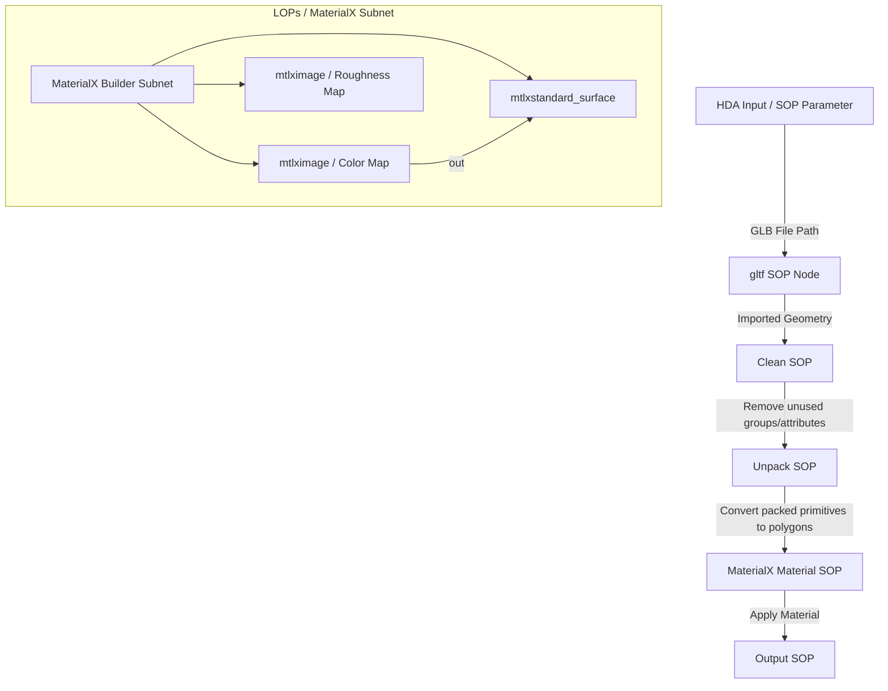

# HouTrellis SOP Import & Material Setup
This document describes the standard SOP network setup for the **HouTrellis SOP Asset**, which automatically imports generated GLB models and configures materials for rendering with **Karma (MaterialX)**.

Since Houdini works natively with sub-networks and HDAs (Houdini Digital Assets), we can construct a robust, procedural importing pipeline inside a SOP Subnet.

---

## 1. Node Network Topology
Below is the node structure to lay out inside your SOP HDA.



---

## 2. Parameter Interface
On your **HouTrellis Import SOP** HDA, create these interface parameters:

| Parameter Label | Parameter Name | Type | Description |
| :--- | :--- | :--- | :--- |
| **GLB File Path** | `file_path` | File (Read) | Path to the generated `.glb` or `.obj` mesh. |
| **Assign Materials** | `assign_mats` | Toggle | Automatically map textures to MaterialX surface. |
| **Material Destination** | `mat_path` | Node Path | Path to the MaterialX builder subnet. |

---

## 3. Node-by-Node Setup Configuration

### Step A: GLTF Import (`gltf` SOP)
By default, the `gltf` node imports meshes as Packed Primitives, which keeps the scene lightweight.
* Set the **File** parameter on the node to:
  `ch("../file_path")` (referencing the HDA parameter).

### Step B: Unpack (`unpack` SOP)
If you want to edit or procedurally manipulate the mesh inside Houdini (remeshing, UV edits, clipping, etc.), unpack the geometry:
* Set **Transfer Attributes** to `*` to keep any vertex colors, UVs, or texture path string attributes present on the GLB.

### Step C: Automatic Material Setup (Python LOP/SOP Helper)
GLB files carry their textures embedded or linked as primitive attributes. To dynamically extract them and assign Karma-ready MaterialX shaders, you can place a Python SOP or standard Material SOP.

To automatically build the MaterialX Network for Karma, you can run this setup script within a Python-based HDA OnCreated script or a Python SOP:

```python
import hou

def setup_material_network(hda_node):
    """
    Creates a Karma/MaterialX shader builder inside the HDA
    to procedurally link generated GLB textures.
    """
    # Create a Material Library LOP or MatNet SOP inside the asset
    matnet = hda_node.createNode("matnet", "trellis_materials")
    
    # Create the MaterialX Subnet
    mtlx_builder = matnet.createNode("mtlxbuilder", "trellis_mtlx")
    
    # Inside the builder, create the surface shader
    std_surface = mtlx_builder.createNode("mtlxstandard_surface", "trellis_surface")
    surface_output = mtlx_builder.node("surface_output")
    
    # Connect standard surface to output
    surface_output.setInput(0, std_surface, 0)
    
    # Create Image Texture node for Base Color
    base_color_img = mtlx_builder.createNode("mtlximage", "base_color_map")
    base_color_img.parm("signature").set("color3")
    
    # Link Image to Standard Surface color
    std_surface.setInput(1, base_color_img, 0) # Input 1 is typically base color
    
    # Set up file path on image map to pull from the imported GLB's textures
    # (TRELLIS exports GLB with standard UVs and textures embedded)
    
    return mtlx_builder
```

### Step D: Quick Karma Direct Render (LOPs Import)
If passing directly to LOPs (Solaris) for rendering:
1. Use a **SOP Import** LOP to bring the geometry into the USD stage.
2. The `SOP Import` has a built-in toggle **"Import GLTF Materials"** which will translate the TRELLIS material properties directly into USD Preview Surface shaders for Karma automatically!
